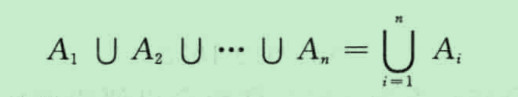
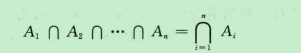

                    2.2 集合运算
    定义1 令A和B为集合。集合A和B的并集，用A∪B表示，是一个集合，它包含A或B中或同时在A和B中的元素。

    一个元素x属于A和B的并集当且仅当x属于A或x属于B。这说明
            A∪B = {x| x ∈ A ∨ x∈ B}
    
    定义2 令A和B为集合。集合A和B的交集，用A∩B表示，是一个集合，它包含同时在A和B中的哪些元素。
    
    一个元素x属于集合A和B的交集当且仅当x属于A而且x属于B。这说明
            a∩B = (x| x ∈ A ∧ x ∈ B)

    定义3 两个集合称为是不相交的，如果它们的交集为空集。

    定义4 令A和B为集合。A和B的差集，用A-B表示，是一个集合，它包含属于A而不属于B的元素。A和B的差集也称为B相对于A的补集

    评注：集合A和B的差集有时候也记为A\B。

        一个元素属于A和B的差集当且仅当x∈A且x!∈B，这说明
            A-B = {x | x ∈ A ∧ x !∈ B}
    一旦指定了全集U，就可以定义集合的补集。
    定义5 令U为全集。集合A的补集，用Cua表示，是A相对于U的补集。所以，集合A的补集是U-A。
        一个元素x属于Cua 当且仅当x!∈A。这说明
                    Cua = {x ∈ U | x !∈ A}

    定义6 一组集合的并集是包含那些至少是这组集合中一个集合成员的元素的集合。
        我们用下列记号
            
        表示A1，A2，...，An的并集
    定义7 一组集合的交集是包含那些属于这组集合中所有成员集合的元素的集合。
        我们用下列记号
            
        表示A1，A2，...，An的交集
